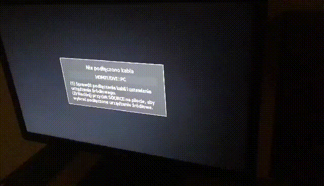

# Cable Reminder Version 1.0

This project is focused on creating a pop-up window that appears on the monitor when a cable is not connected to it.

The project utilizes advanced animation techniques to create a visually striking and attention-grabbing reminder for the user. The animation is designed to simulate the monitor screen, when cable is unplugged.

Creating this project was a challenging task, as it required a deep understanding of animation principles and programming concepts. Despite the difficulty, I am proud to say that I was able to successfully replicate the desired effect and deliver a polished final product.

I hope that this project proves to be useful for anyone who struggles with remembering to connect cables to their monitor. Thank you for checking out my project!

[check this out!](https://kacperkwinta.github.io/Cable-Reminder/)

### Original design

